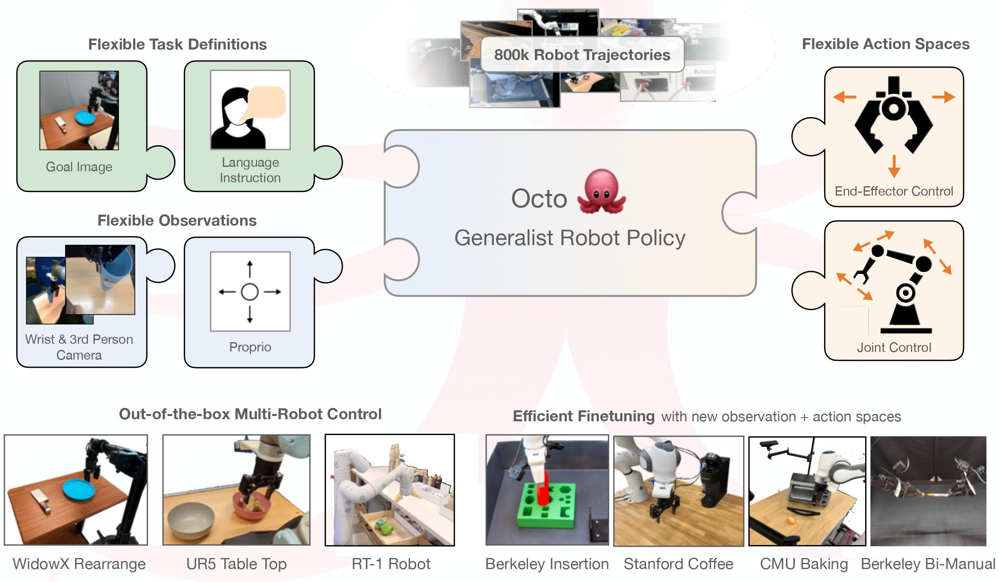

# Octo
[](https://githubtocolab.com/octo-models/octo/blob/main/examples/01_inference_pretrained.ipynb)
[](https://opensource.org/licenses/MIT)
[](https://octo-models.github.io/)


This repo contains code for training and finetuning Octo generalist robotic policies (GRPs).
Octo models are transformer-based diffusion policies, trained on a diverse mix of 800k robot trajectories.

## Get Started

Follow the installation instructions, then load a pretrained Octo model! See [examples](examples/) for guides to zero-shot evaluation and finetuning and [](https://colab.research.google.com/drive/1z0vELj_lX9OWeoMG_WvXnQs43aPOEAhz?usp=sharing)
for an inference example.

```python
from octo.model.octo_model import OctoModel
model = OctoModel.load_pretrained("hf://rail-berkeley/octo-base-1.5")
print(model.get_pretty_spec())
```



Out of the box, Octo supports multiple RGB camera inputs, can control various robot arms,
and can be instructed via language commands or goal images.
Octo uses a modular attention structure in its transformer backbone, allowing it to be effectively finetuned
to robot setups with new sensory inputs, action spaces, and morphologies, using only a small target domain
dataset and accessible compute budgets.


## Installation
```bash
conda create -n octo python=3.10
conda activate octo
pip install -e .
pip install -r requirements.txt
```
For GPU:
```bash
pip install --upgrade "jax[cuda11_pip]==0.4.20" -f https://storage.googleapis.com/jax-releases/jax_cuda_releases.html
```

For TPU
```bash
pip install --upgrade "jax[tpu]==0.4.20" -f https://storage.googleapis.com/jax-releases/libtpu_releases.html
```
See the [Jax Github page](https://github.com/google/jax) for more details on installing Jax.

Test the installation by finetuning on the debug dataset:
```bash
python scripts/finetune.py --config.pretrained_path=hf://rail-berkeley/octo-small-1.5 --debug
```

## Checkpoints

You can find pretrained Octo checkpoints [here](https://huggingface.co/rail-berkeley).
At the moment we provide the following model versions:

| Model                                                         | Inference on 1x NVIDIA 4090 | Size       |
|---------------------------------------------------------------|-----------------------------|------------|
| [Octo-Base](https://huggingface.co/rail-berkeley/octo-base)   | 13 it/sec                   | 93M Params |
| [Octo-Small](https://huggingface.co/rail-berkeley/octo-small) | 17 it/sec                   | 27M Params |


## Examples

We provide simple [example scripts](examples) that demonstrate how to use and finetune Octo models,
as well as how to use our data loader independently. We provide the following examples:

|                                                                      |                                                                                                                    |
|----------------------------------------------------------------------|--------------------------------------------------------------------------------------------------------------------|
| [Octo Inference](examples/01_inference_pretrained.ipynb)             | Minimal example for loading and running a pretrained Octo model                                                    |
| [Octo Finetuning](examples/02_finetune_new_observation_action.py)    | Minimal example for finetuning a pretrained Octo models on a small dataset with a new observation and action space |
| [Octo Rollout](examples/03_eval_finetuned.py)                        | Run a rollout of a pretrained Octo policy in a Gym environment                                                     |
| [Octo Robot Eval](examples/04_eval_finetuned_on_robot.py)            | Evaluate a pretrained Octo model on a real WidowX robot                                                            |
| [OpenX Dataloader Intro](examples/05_dataloading.ipynb)              | Walkthrough of the features of our Open X-Embodiment data loader                                                   |
| [OpenX PyTorch Dataloader](examples/06_pytorch_oxe_dataloader.ipynb) | Standalone Open X-Embodiment data loader in PyTorch                                                                |


## Octo Pretraining

To reproduce our Octo pretraining on 800k robot trajectories, run:
```bash
python scripts/train.py --config scripts/configs/octo_pretrain_config.py:<size> --name=octo --config.dataset_kwargs.oxe_kwargs.data_dir=... --config.dataset_kwargs.oxe_kwargs.data_mix=oxe_magic_soup ...
```

To download the pretraining dataset from the [Open X-Embodiment Dataset](https://robotics-transformer-x.github.io/),
install the [rlds_dataset_mod package](https://github.com/kpertsch/rlds_dataset_mod)
and run the [prepare_open_x.sh script](https://github.com/kpertsch/rlds_dataset_mod/blob/main/prepare_open_x.sh).
The total size of the pre-processed dataset is ~1.2TB.

We run pretraining using a TPUv4-128 pod in 8 hours for the Octo-S model and in 14 hours for Octo-B.


## Octo Finetuning

We provide a [minimal example](examples/02_finetune_new_observation_action.py) for finetuning with a new observation and action space.

We also provide a more advanced finetuning script that allows you to change hyperparameters via a config file and logs finetuning
metrics. To run advanced finetuning, use:
```bash
python scripts/finetune.py --config.pretrained_path=hf://rail-berkeley/octo-small-1.5
```

We offer three finetuning modes depending on the parts of the model that are kept frozen: ```head_only```, ```head_mlp_only```, and ```full``` to finetune the full model.
Additionally, one can specify the task type to finetune with: ```image_conditioned```, ```language_conditioned``` or ```multimodal``` for both.
For example, to finetune the full transformer with image inputs only use:
```--config=finetune_config.py:full,image_conditioned```.


## Octo Evaluation

Loading and running a trained Octo model is as easy as:
```python
from octo.model import OctoModel

model = OctoModel.load_pretrained("hf://rail-berkeley/octo-small-1.5")
task = model.create_tasks(texts=["pick up the spoon"])
action = model.sample_actions(observation, task, rng=jax.random.PRNGKey(0))
```

We provide examples for evaluating Octo [in a simulated Gym environment](examples/03_eval_finetuned.py) as well
as [on a real WidowX robot](examples/04_eval_finetuned_on_robot.py).

To evaluate on your own environment, simply wrap it in a Gym interface and follow the instructions in the
[Eval Env README](examples/envs/README.md).


## Code Structure

|                     | File                                                    | Description                                                                   |
|---------------------|---------------------------------------------------------|-------------------------------------------------------------------------------|
| Hyperparameters     | [config.py](scripts/configs/config.py)                  | Defines all hyperparameters for the training run.                             |
| Pretraining Loop    | [train.py](scripts/train.py)                            | Main pretraining script.                                                         |
| Finetuning Loop     | [finetune.py](scripts/finetune.py)                      | Main finetuning script.                                                       |
| Datasets            | [dataset.py](octo/data/dataset.py)                      | Functions for creating single / interleaved datasets + data augmentation.     |
| Tokenizers          | [tokenizers.py](octo/model/components/tokenizers.py)    | Tokenizers that encode image / text inputs into tokens.                       |
| Octo Model          | [octo_model.py](octo/model/octo_model.py)               | Main entry point for interacting with Octo models: loading, saving, and inference. |
| Model Architecture  | [octo_module.py](octo/model/octo_module.py)             | Combines token sequencing, transformer backbone and readout heads.            |
| Visualization       | [visualization_lib.py](octo/utils/visualization_lib.py) | Utilities for offline qualitative & quantitative eval.                        |

## FAQ
#### What is the `timestep_pad_mask` in the observation dictionary?
The `timestep_pad_mask` indicates which observations should be attended to, which is important when using multiple timesteps of observation history. Octo was trained with a history window size of 2, meaning the model can predict an action using both the current observation and the previous observation. However, at the very beginning of the trajectory, there is no previous observation, so we need to set `timestep_pad_mask=False` at the corresponding index. If you use Octo with a window size of 1, `timestep_pad_mask` should always just be `[True]`, indicating that the one and only observation in the window should be attended to. Note that if you wrap your robot environment with the `HistoryWrapper` (see [gym_wrappers.py](octo/utils/gym_wrappers.py)), the `timestep_pad_mask` key will be added to the observation dictionary for you.
#### What is `pad_mask_dict` in the observation dictionary?
While `timestep_pad_mask` indicates which observations should be attended to on a timestep level, `pad_mask_dict` indicates which elements of the observation should be attended to within a single timestep. For example, for datasets without language labels, `pad_mask_dict["language_instruction"]` is set to `False`. For datasets without a wrist camera, `pad_mask_dict["image_wrist"]` is set to `False`. For convenience, if a key is missing from the observation dict, it is equivalent to setting `pad_mask_dict` to `False` for that key.
#### Does `model.sample_actions([...])` return the full trajectory to solve a task?
Octo was pretrained with an action chunking size of 4, meaning it predicts the next 4 actions at once. You can choose to execute all these actions before sampling new ones, or only execute the first action before sampling new ones (also known as receding horizon control). You can also do something more advanced like [temporal ensembling](octo/utils/gym_wrappers.py).

## Updates for Version 1.5
- Improved cross-attention between visual and language tokens by repeating language tokens at every timestep in the context window.
- Augmented the language instructions in the data with rephrasings from GPT-3.5.
- Bug fixes:
  - Turned off dropout in the diffusion head due to incompatibility with layer norm.
  - Fixed an off-by-one error with the attention mask.
  - Fixed an issue where different image augmentations did not get fresh random seeds.

## install tips
1. cuda+cudnn
```bash
# cuda12.2 
# 官网下载runfile版本-运行-取消勾选driver-install:
# add to .bashrc
export PATH=$PATH:/usr/local/cuda-12.2/bin
export LD_LIBRARY_PATH=$LD_LIBRARY_PATH:/usr/local/cuda-12.2/lib64
export LIBRARY_PATH=$LIBRARY_PATH:/usr/local/cuda-12.2/lib64
```
```bash
# cudnn8.9:
tar -xf cudnn-linux-x86_64-8.9.7.29_cuda12-archive.tar.xz
sudo cp lib/* /usr/local/cuda-12.2/lib64/
sudo cp include/* /usr/local/cuda-12.2/include
```

## error rec
1. batch_size设置为1，刚开始ok，过了几天运行finetune.py会报错
```bash
  0%|                                                                                                                        | 0/2100 [00:00<?, ?it/s]/home/lab/miniconda3/envs/octo/lib/python3.10/site-packages/huggingface_hub/file_download.py:1132: FutureWarning: `resume_download` is deprecated and will be removed in version 1.0.0. Downloads always resume when possible. If you want to force a new download, use `force_download=True`.
  warnings.warn(
I0623 20:04:16.294819 139756573373632 octo_module.py:219] repeating task tokens at each timestep to perform cross-modal attention
I0623 20:04:22.180553 139756573373632 compiler.py:323] Persistent compilation cache hit for 'jit_train_step'
2024-06-23 20:04:22.388678: W external/xla/xla/service/gpu/runtime/support.cc:58] Intercepted XLA runtime error:
UNKNOWN: CUDNN_STATUS_NOT_SUPPORTED
in external/xla/xla/stream_executor/cuda/cuda_dnn.cc(7424): 'plan' CUDNN_BACKEND_EXECUTION_PLAN_DESCRIPTOR: cudnnFinalize Descriptor Failed
2024-06-23 20:04:22.389014: E external/xla/xla/pjrt/pjrt_stream_executor_client.cc:2716] Execution of replica 0 failed: INTERNAL: Failed to execute XLA Runtime executable: run time error: custom call 'xla.gpu.conv.backward.filter' failed: CUDNN_STATUS_NOT_SUPPORTED
in external/xla/xla/stream_executor/cuda/cuda_dnn.cc(7424): 'plan' CUDNN_BACKEND_EXECUTION_PLAN_DESCRIPTOR: cudnnFinalize Descriptor Failed; current tracing scope: cudnn-conv-bw-filter.15; current profiling annotation: XlaModule:#hlo_module=jit_train_step,program_id=74#.
  0%|                                                                                                                        | 0/2100 [00:06<?, ?it/s]
jax.errors.SimplifiedTraceback: For simplicity, JAX has removed its internal frames from the traceback of the following exception. Set JAX_TRACEBACK_FILTERING=off to include these.

The above exception was the direct cause of the following exception:

Traceback (most recent call last):
  File "/home/lab/hanxiao/octo/scripts/finetune.py", line 411, in <module>
    app.run(main)
  File "/home/lab/miniconda3/envs/octo/lib/python3.10/site-packages/absl/app.py", line 308, in run
    _run_main(main, args)
  File "/home/lab/miniconda3/envs/octo/lib/python3.10/site-packages/absl/app.py", line 254, in _run_main
    sys.exit(main(argv))
  File "/home/lab/hanxiao/octo/scripts/finetune.py", line 379, in main
    train_state, update_info = train_step(train_state, batch)
jaxlib.xla_extension.XlaRuntimeError: INTERNAL: Failed to execute XLA Runtime executable: run time error: custom call 'xla.gpu.conv.backward.filter' failed: CUDNN_STATUS_NOT_SUPPORTED
in external/xla/xla/stream_executor/cuda/cuda_dnn.cc(7424): 'plan' CUDNN_BACKEND_EXECUTION_PLAN_DESCRIPTOR: cudnnFinalize Descriptor Failed; current tracing scope: cudnn-conv-bw-filter.15; current profiling annotation: XlaModule:#hlo_module=jit_train_step,program_id=74#.
```
但是当我注释fineturn.py中的以下内容时或者修改batch_size>1,可以顺利执行（我发现examples中的02...没有这几行）
```python
    def train_step(state: TrainState, batch):
        rng, dropout_rng = jax.random.split(state.rng)
        (loss, info), grads = jax.value_and_grad(loss_fn, has_aux=True)(
            state.model.params, batch, dropout_rng, train=True
        )
        # grad_norm = optax.global_norm(grads)
        # updates, _ = state.tx.update(grads, state.opt_state, state.model.params)
        # update_norm = optax.global_norm(updates)
        # info.update(
        #     {
        #         "grad_norm": grad_norm,
        #         "update_norm": update_norm,
        #         "param_norm": param_norm_callable(state.model.params),
        #         "learning_rate": lr_callable(state.step),
        #     }
        # )
        new_state = state.apply_gradients(grads=grads, rng=rng)
        return new_state, info
```
2. 为什么执行这个finetune.py的命令在linux终端执行速度比在vscode终端的执行速度快，我发现在vscode终端的代理没有挂，但是我在vscode终端export http_proxy="127.0.0.1:7890"之后直接网络错误了

## Citation

```
@inproceedings{octo_2023,
    title={Octo: An Open-Source Generalist Robot Policy},
    author = {{Octo Model Team} and Dibya Ghosh and Homer Walke and Karl Pertsch and Kevin Black and Oier Mees and Sudeep Dasari and Joey Hejna and Charles Xu and Jianlan Luo and Tobias Kreiman and {You Liang} Tan and Pannag Sanketi and Quan Vuong and Ted Xiao and Dorsa Sadigh and Chelsea Finn and Sergey Levine},
    booktitle = {Proceedings of Robotics: Science and Systems},
    address  = {Delft, Netherlands},
    year = {2024},
}
```
